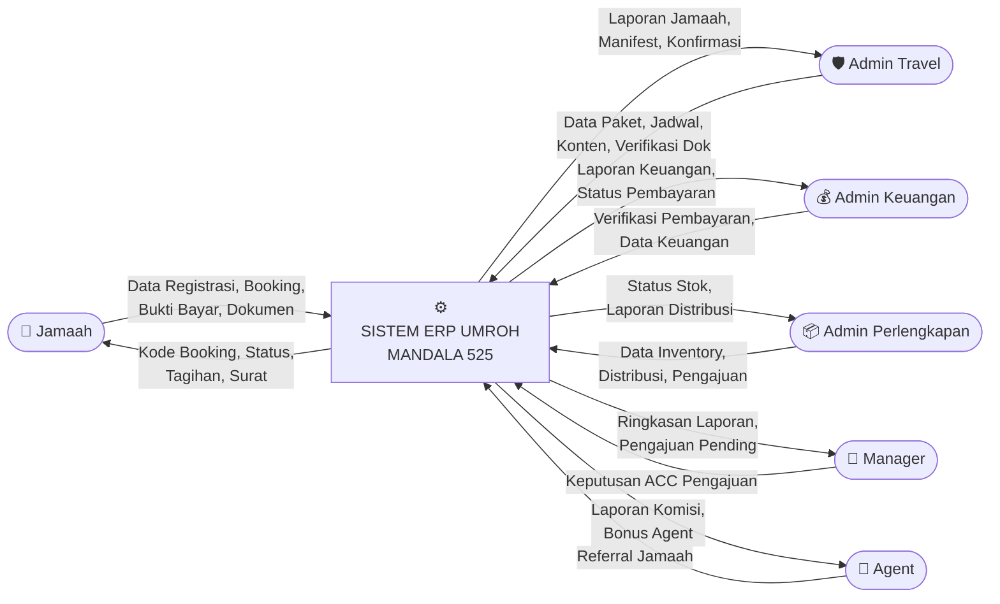
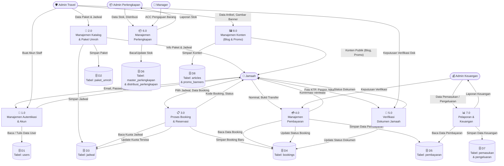
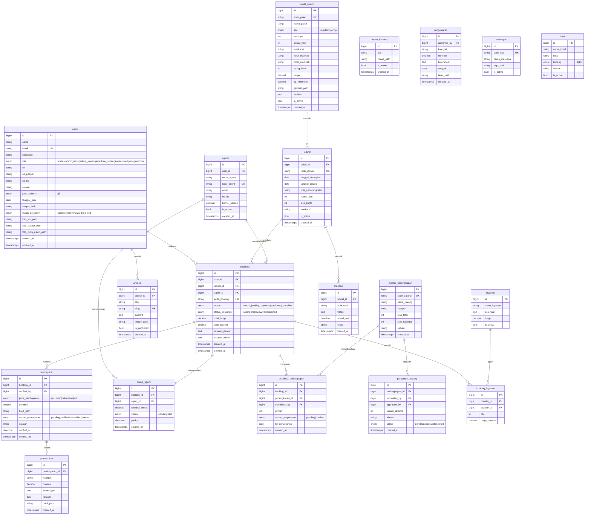

# 📊 Pendekatan Terstruktur — DFD & ERD
## Aplikasi ERP Umroh Mandala 525

---

## 1. Data Flow Diagram (DFD)

### Level 0 — Context Diagram

Gambaran sistem secara keseluruhan sebagai satu proses tunggal dengan semua entitas eksternal.

---

### Level 1 — Diagram Detail per Proses

Memecah sistem menjadi sub-proses utama beserta aliran data dan penyimpanan (data store).

---

## 2. Entity Relationship Diagram (ERD)

Rancangan basis data lengkap beserta atribut dan relasi antar tabel.

---

## 📋 Kamus Data (Data Dictionary)

### Tabel Utama & Penjelasan

| Tabel | Fungsi | Relasi Kunci |
|---|---|---|
| `users` | Menyimpan semua pengguna sistem (semua role) | Induk dari `bookings`, `articles` |
| `paket_umroh` | Master data paket perjalanan umroh | Induk dari `jadwal` |
| `jadwal` | Jadwal keberangkatan per paket | Induk dari `bookings`, `manasik` |
| `bookings` | Transaksi reservasi jamaah per jadwal | Pusat relasi, terhubung ke hampir semua tabel |
| `pembayaran` | Riwayat setiap transaksi pembayaran per booking | Anak dari `bookings`, sumber `pemasukan` |
| `agents` | Data mitra agen/reseller eksternal | Berelasi ke `bookings` dan `bonus_agent` |
| `promo_banners` | Gambar slider promo di halaman beranda | Standalone, dikelola admin |
| `articles` | Konten blog/berita untuk publik | `author_id` → `users.id` |
| `master_perlengkapan` | Stok perlengkapan umroh (koper, baju, dll) | Sumber `distribusi_perlengkapan` |
| `distribusi_perlengkapan` | Catatan distribusi barang ke jamaah | Junction: `bookings` ↔ `master_perlengkapan` |
| `pemasukan` | Catatan pemasukan keuangan kantor | Sumber: `pembayaran` yang verified |
| `pengeluaran` | Catatan pengeluaran / biaya operasional | Standalone, diisi admin keuangan |
| `manasik` | Sesi jadwal bimbingan ibadah per jadwal | Anak dari `jadwal` |
| `booking_layanan` | Layanan tambahan yang dipilih jamaah | Junction: `bookings` ↔ `layanan` |

### Enum Status Booking

| Status | Kondisi |
|---|---|
| `pending` | Booking baru dibuat, belum ada pembayaran |
| `waiting_payment` | Sudah ada sebagian pembayaran, belum lunas |
| `confirmed` | Pembayaran lunas & dokumen valid |
| `cancelled` | Dibatalkan oleh jamaah / sistem |

### Enum Status Dokumen

| Status | Kondisi |
|---|---|
| `incomplete` | Belum upload dokumen |
| `review` | Dokumen sudah diupload, menunggu verifikasi admin |
| `valid` | Dokumen disetujui oleh admin travel |
| `rejected` | Dokumen ditolak, jamaah harus upload ulang |
