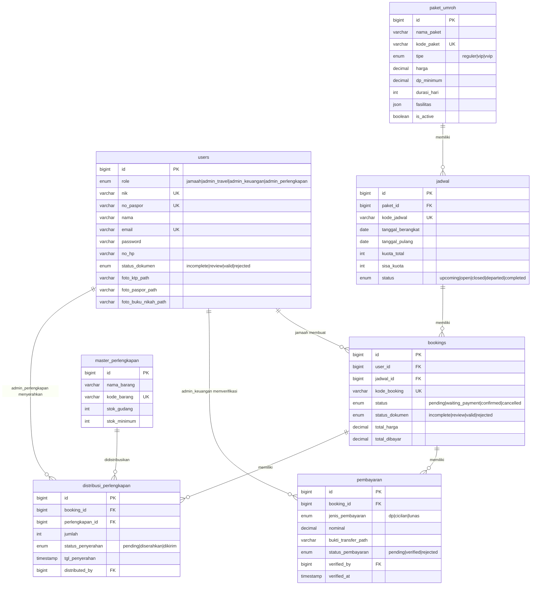
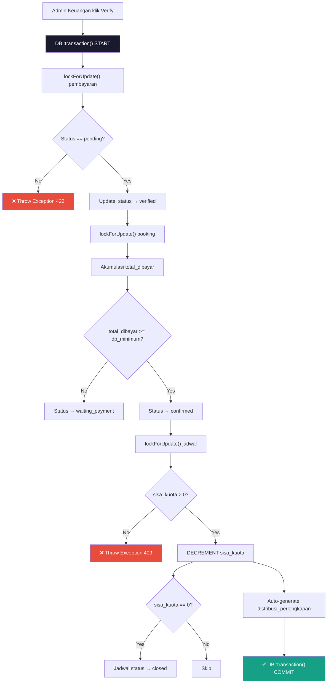
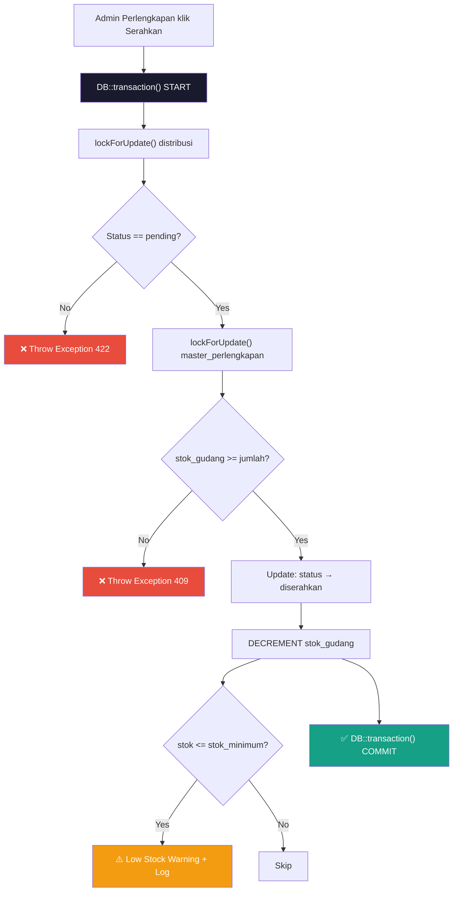

# 🕌 Arsitektur ERP Travel Umroh — Full Documentation

## Tech Stack
| Layer | Technology |
|-------|-----------|
| **Backend** | Laravel (PHP 8.2+) |
| **Database** | MySQL |
| **Auth** | Laravel Sanctum (Token-based API) |
| **Frontend** | Next.js (React) — *dikonsumsi via API* |

---

## 📁 Struktur File yang Dibuat

```
d:\2026\HANSCO\WEB\tugas\
├── database/migrations/
│   ├── 2026_04_29_000001_create_users_table.php
│   ├── 2026_04_29_000002_create_paket_umroh_table.php
│   ├── 2026_04_29_000003_create_jadwal_table.php
│   ├── 2026_04_29_000004_create_bookings_table.php
│   ├── 2026_04_29_000005_create_pembayaran_table.php
│   ├── 2026_04_29_000006_create_master_perlengkapan_table.php
│   └── 2026_04_29_000007_create_distribusi_perlengkapan_table.php
├── database/seeders/
│   └── DatabaseSeeder.php
├── app/Models/
│   ├── User.php
│   ├── PaketUmroh.php
│   ├── Jadwal.php
│   ├── Booking.php
│   ├── Pembayaran.php
│   ├── MasterPerlengkapan.php
│   └── DistribusiPerlengkapan.php
├── app/Http/Controllers/Api/
│   ├── AuthController.php
│   ├── CatalogController.php
│   ├── BookingController.php
│   ├── TravelAdminController.php
│   ├── PaymentController.php          ← ✅ verifyPayment()
│   └── EquipmentController.php        ← ✅ handoverEquipment()
├── app/Http/Middleware/
│   └── CheckRole.php
└── routes/
    └── api.php
```

---

## 🗄️ Entity Relationship Diagram (ERD)



---

## 🔗 Model Relationships Summary

| Model | Relationship | Target | Type |
|-------|-------------|--------|------|
| **User** | `bookings()` | Booking | HasMany |
| **User** | `verifiedPayments()` | Pembayaran | HasMany (via `verified_by`) |
| **User** | `distributedItems()` | DistribusiPerlengkapan | HasMany (via `distributed_by`) |
| **User** | `jadwalDiikuti()` | Jadwal | BelongsToMany (via bookings) |
| **PaketUmroh** | `jadwal()` | Jadwal | HasMany |
| **PaketUmroh** | `bookings()` | Booking | HasManyThrough (via Jadwal) |
| **Jadwal** | `paket()` | PaketUmroh | BelongsTo |
| **Jadwal** | `bookings()` | Booking | HasMany |
| **Jadwal** | `jamaahTerdaftar()` | User | BelongsToMany (via bookings) |
| **Booking** | `user()` / `jamaah()` | User | BelongsTo |
| **Booking** | `jadwal()` | Jadwal | BelongsTo |
| **Booking** | `pembayaran()` | Pembayaran | HasMany |
| **Booking** | `distribusiPerlengkapan()` | DistribusiPerlengkapan | HasMany |
| **Booking** | `perlengkapan()` | MasterPerlengkapan | BelongsToMany (via distribusi) |
| **Pembayaran** | `booking()` | Booking | BelongsTo |
| **Pembayaran** | `verifier()` | User | BelongsTo (via `verified_by`) |
| **MasterPerlengkapan** | `distribusi()` | DistribusiPerlengkapan | HasMany |
| **MasterPerlengkapan** | `bookings()` | Booking | BelongsToMany (via distribusi) |
| **DistribusiPerlengkapan** | `booking()` | Booking | BelongsTo |
| **DistribusiPerlengkapan** | `perlengkapan()` | MasterPerlengkapan | BelongsTo |
| **DistribusiPerlengkapan** | `distributor()` | User | BelongsTo (via `distributed_by`) |

---

## 🔄 Dua Proses Kritis (Core Integration)

### 1️⃣ `verifyPayment()` — [PaymentController.php](file:///d:/2026/HANSCO/WEB/tugas/app/Http/Controllers/Api/PaymentController.php#L83-L180)



> [!IMPORTANT]
> **Pessimistic Locking** (`lockForUpdate()`) digunakan pada 3 tabel: `pembayaran`, `bookings`, dan `jadwal` untuk mencegah race condition saat concurrent access.

### 2️⃣ `handoverEquipment()` — [EquipmentController.php](file:///d:/2026/HANSCO/WEB/tugas/app/Http/Controllers/Api/EquipmentController.php#L134-L218)



---

## 🌐 API Endpoints (35+ Endpoints)

### Public (No Auth)
| Method | Endpoint | Controller | Deskripsi |
|--------|----------|-----------|-----------|
| POST | `/api/auth/register` | AuthController | Register jamaah baru |
| POST | `/api/auth/login` | AuthController | Login semua role |
| GET | `/api/katalog/paket` | CatalogController | List paket umroh |
| GET | `/api/katalog/paket/{id}` | CatalogController | Detail paket + jadwal |
| GET | `/api/katalog/jadwal` | CatalogController | List jadwal tersedia |
| GET | `/api/katalog/jadwal/{id}` | CatalogController | Detail jadwal + kuota |

### Jamaah (Auth + role:jamaah)
| Method | Endpoint | Controller | Deskripsi |
|--------|----------|-----------|-----------|
| POST | `/api/auth/logout` | AuthController | Logout |
| GET | `/api/auth/profile` | AuthController | Get profil |
| PUT | `/api/auth/profile` | AuthController | Update profil |
| POST | `/api/auth/upload-dokumen` | AuthController | Upload KTP/Paspor/BN |
| GET | `/api/jamaah/bookings` | BookingController | List booking saya |
| GET | `/api/jamaah/bookings/{kode}` | BookingController | Detail booking |
| POST | `/api/jamaah/bookings` | BookingController | Checkout / buat booking |
| POST | `/api/jamaah/bookings/{kode}/bayar` | BookingController | Upload bukti transfer |
| POST | `/api/jamaah/bookings/{kode}/cancel` | BookingController | Batalkan booking |

### Admin Travel (Auth + role:admin_travel)
| Method | Endpoint | Controller | Deskripsi |
|--------|----------|-----------|-----------|
| GET | `/api/admin/travel/paket` | TravelAdminController | List paket |
| POST | `/api/admin/travel/paket` | TravelAdminController | Tambah paket |
| PUT | `/api/admin/travel/paket/{id}` | TravelAdminController | Edit paket |
| DELETE | `/api/admin/travel/paket/{id}` | TravelAdminController | Hapus paket |
| GET | `/api/admin/travel/jadwal` | TravelAdminController | List jadwal |
| POST | `/api/admin/travel/jadwal` | TravelAdminController | Tambah jadwal |
| PUT | `/api/admin/travel/jadwal/{id}` | TravelAdminController | Edit jadwal |
| GET | `/api/admin/travel/dokumen` | TravelAdminController | List dokumen |
| POST | `/api/admin/travel/dokumen/{id}/verify` | TravelAdminController | Verify dokumen |
| GET | `/api/admin/travel/manifest/{jadwalId}` | TravelAdminController | Cetak manifest |

### Admin Keuangan (Auth + role:admin_keuangan)
| Method | Endpoint | Controller | Deskripsi |
|--------|----------|-----------|-----------|
| GET | `/api/admin/keuangan/pembayaran` | PaymentController | List pembayaran |
| GET | `/api/admin/keuangan/pembayaran/{id}` | PaymentController | Detail pembayaran |
| POST | `/api/admin/keuangan/pembayaran/{id}/verify` | PaymentController | ✅ **Verify payment** |
| POST | `/api/admin/keuangan/pembayaran/{id}/reject` | PaymentController | Reject payment |
| GET | `/api/admin/keuangan/laporan/pendapatan` | PaymentController | Laporan pendapatan |

### Admin Perlengkapan (Auth + role:admin_perlengkapan)
| Method | Endpoint | Controller | Deskripsi |
|--------|----------|-----------|-----------|
| GET | `/api/admin/perlengkapan/master` | EquipmentController | List barang |
| POST | `/api/admin/perlengkapan/master` | EquipmentController | Tambah barang |
| PUT | `/api/admin/perlengkapan/master/{id}` | EquipmentController | Edit barang |
| DELETE | `/api/admin/perlengkapan/master/{id}` | EquipmentController | Hapus barang |
| GET | `/api/admin/perlengkapan/distribusi` | EquipmentController | List distribusi |
| POST | `/api/admin/perlengkapan/distribusi/{id}/handover` | EquipmentController | ✅ **Handover** |
| POST | `/api/admin/perlengkapan/distribusi/batch-handover` | EquipmentController | Batch handover |
| GET | `/api/admin/perlengkapan/laporan/stok` | EquipmentController | Laporan stok |

---

## 🔐 Concurrency & Transaction Strategy

> [!CAUTION]
> Tanpa DB Transaction dan Pessimistic Locking, sistem rentan terhadap:
> - **Overbooking**: 2 jamaah membayar bersamaan → kuota menjadi negatif
> - **Double-verify**: Admin klik verify 2x → nominal terakumulasi 2x
> - **Stok negatif**: 2 admin menyerahkan barang terakhir bersamaan

| Proses | Lock Strategy | Tabel yang Di-lock |
|--------|--------------|-------------------|
| `verifyPayment()` | `lockForUpdate()` | pembayaran, bookings, jadwal |
| `handoverEquipment()` | `lockForUpdate()` | distribusi_perlengkapan, master_perlengkapan |
| `batchHandover()` | `lockForUpdate()` | distribusi_perlengkapan (batch), master_perlengkapan |
| `checkout()` | `lockForUpdate()` | jadwal (cek kuota) |

---

## 🧪 Test Accounts (Seeder)

| Role | Email | Password |
|------|-------|----------|
| Jamaah | `jamaah@example.com` | `password123` |
| Admin Travel | `travel@admin.com` | `password123` |
| Admin Keuangan | `keuangan@admin.com` | `password123` |
| Admin Perlengkapan | `perlengkapan@admin.com` | `password123` |

---

## 🚀 Setup Instructions

```bash
# 1. Install dependencies
composer install

# 2. Copy .env dan configure database
cp .env.example .env
# Edit .env: DB_DATABASE, DB_USERNAME, DB_PASSWORD

# 3. Generate app key
php artisan key:generate

# 4. Run migrations
php artisan migrate

# 5. Seed data awal
php artisan db:seed

# 6. Install Sanctum
php artisan vendor:publish --provider="Laravel\Sanctum\SanctumServiceProvider"

# 7. Register middleware 'role' di app/Http/Kernel.php atau bootstrap/app.php
# Tambahkan: 'role' => \App\Http\Middleware\CheckRole::class

# 8. Jalankan server
php artisan serve
```

> [!NOTE]
> Pastikan untuk mendaftarkan middleware `role` di `bootstrap/app.php` (Laravel 11+) atau `app/Http/Kernel.php` (Laravel 10):
> ```php
> // bootstrap/app.php (Laravel 11+)
> ->withMiddleware(function (Middleware $middleware) {
>     $middleware->alias([
>         'role' => \App\Http\Middleware\CheckRole::class,
>     ]);
> })
> ```
